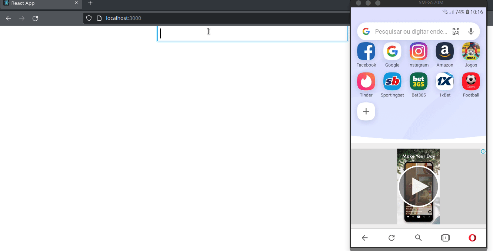

<div>
  <h1 align="center">QR Code Generator</h1> 
</div>
  
 <div align="center">
  
 </div>
  
  <br>
  
 ## 💻 Project
 This app was developed in Javascript and React JS. It is a QR code generator for easy use and sharing of URLs.
 
<h3>In this application you can:</h3>

<ul>
<li>Type any URL of a website on the internet, and turn it into a QR code.</li>
</ul>

## 🚀 Installation

- Important: You must have installed the Node.js, Yarn and Git

```bash
# clone it
$ git clone https://github.com/riandk1/qrcode_generator.git

# Install dependencies
$ yarn

# Running script
$ yarn start
```
And enter in your browser using http://localhost:3000

## 🧪 Technologies

This project was developed with the following technologies:

-  ReactJS

-  Javascript

## 🏃🏼‍♂️ Project Demo

<h4>You can see a demo of this app. Just click <a href='https://riandk1.github.io/qrcode_generator/'>here!</a></h4>
